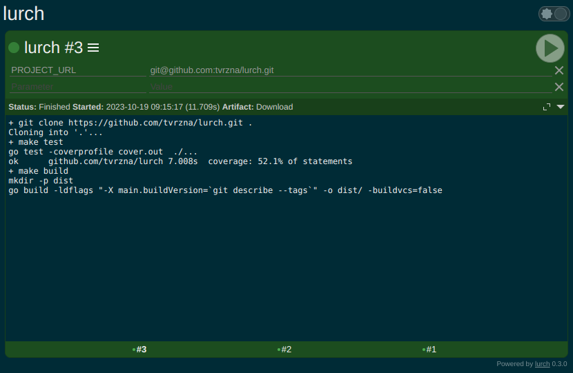

# lurch

Simple CI/CD without database or any dependency



## Usage
```
Usage: lurch [options]
Options:
	-h, --help			print this help
	-v, --version			print version
	-t, --path [PATH]		absolute path to work dir
	-p, --port [PORT]		sets port for listening
	-a, --app-url [APP_URL]		application url (if behind proxy)
	-n, --name [NAME]		name of application to be displayed
```

## How to setup project
1. In `workdir` create a folder with name that represents the project.
2. In created folder create `script.sh` and add execute permission to it. Or for Windows create `script.cmd`.
3. Create your shell script with some content e.g.
```bash
#!/bin/sh -e

git clone repository ./

make test

make clean build

scp target/build server:/opt/www

rm -rf .git/
```
4. Open lurch in browser and start the job.

## Roadmap
- [x] Core (0.1.0)
- [x] REST API (0.1.0)
- [x] Web UI (0.1.0)
- [X] Build parameters passed as environmentals (0.2.0)
- [ ] Hide dot project (e.g. `.ignored-project`)
- [ ] Dark theme
- [ ] Custom name of application
- [ ] System log into output (e.g. when job is started or finished + its duration)
- [ ] Periodical watcher (running custom script saving state of last check)